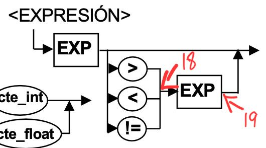

# Compiladores. Little Duck - PHMaci

## Entrega $0

#### Expresiones Regulares

- ID -> ^\\$[a-zA-Z0-9]+
- CTE_STRING -> "[.*]"
- CTE_INT -> [0-9]+
- CTE_FLOAT -> [0-9]+\\.[0-9]+

#### Lista de Tokens

- program, main, void, end, var, int, float, print, do, while, if, else
- ( ) { } [ ] , : ;
- \+ \- \* / = > < !=

## Entrega $1

La investigación de herramientas resultó sencillo gracias a un repositorio que recogía las principales herramientas para el propósito de la entrega:

> https://gist.github.com/dimitrio-m/cf6cde052787ed97164fe6422a5e4cb0

Dado que mi propósito en un principio era hacerlo con PHP, el hecho de que no estuviera en la lista me hizo cambiar de opinión a otro lenguaje que me gusta mucho, el cual es Javascript, y, aunque ANTLR no era la primera como sí lo era Nearley, su documentación me resultó más complicada de entender, encontrando además con la segunda la opción de PHP en su documentación y ejemplos claros de su uso; Por esto último, cuando exploré la documentación del proceso en PHP se me hizo más fácil hacerlo en Javascript por el hecho del package.json y la instalación de dependencias como la evidentemente necesaria ANTLR4, sin dejar de lado la inspiración de PHP al seguir un poco su sintaxis.

En esta entrega cambié el REGEX de ID debido a problemas de ANTLR, ya que, al tratar de omitir las " entre cualquier string ( " '"' " ), no detectaba cuando se procesaba un ejemplo.
El lenguaje con el que basé mi sintaxis fue PHP, viniendo de ahí el nombre; sin embargo, para generar los archivos necesarios para el árbol usé Javascript.

---

Los archivos necesarios para compilar los archivos LittleDuckParser y LittleDuckLexer ya existen en la carpeta antlr, pero si se quieren volver a generar se tiene que correr el siguiente comando:

_Asegúrese de estar en la carpeta antes mencionada antes de correr los siguientes comandos._

> antlr4 -Dlanguage=JavaScript LittleDuckLexer.g4
> antlr4 -Dlanguage=JavaScript LittleDuckParser.g4

_Si tiene problemas al ejecutar los comandos, probablemente se debe a que no tiene instalado antlr4, por lo que lo puede descargar de la siguiente forma:_

> sudo curl -O https://www.antlr.org/download/antlr-4.13.1-complete.jar

_Considera tener la última versión de Java, la cual puede descargar en la siguiente liga:_

> https://www.oracle.com/java/technologies/downloads/

---

Ahora, la forma de correr compilar los tests es de la siguiente forma:

> npm install

> npm run compile

_En esta entrega solo se muestra en consola el árbol de análisis sintáctico._

## Entrega $2

En esta etapa, el primer paso fue decidir qué tipo de estructura se usaría para la parte de la semántica del directorio de funciones y sus tablas de variables, yéndonos por el camino más ágil por _llaves_ como lo son los **diccionarios** y seccionadas en clases.
Por otro lado, también se tuvo que crear el cubo semántico (el cual **no** haremos uso de él **todavía**) para tener los tipos que arrojaría cuando se haga uso de un operador. Para estos casos, decidí hacer una tabla, donde **I** es igual a _INTEGER_, mientras que **F** es igual a _FLOAT_, siendo los únicos dos tipos de variable con los que cuenta nuestro programa; pudiendo interacturar con distintos operadores y demostrando una salida para cuando X variable de cierto tipo (I o F) se procesan de acuerdo al operador.
En la siguiente tabla se muestran todas las combinaciones posibles para los operadores con las que cuenta la gramática:

|     | I I | I F | F I | F F |
| --- | --- | --- | --- | --- |
| +   | I   | F   | F   | F   |
| -   | I   | F   | F   | F   |
| \*  | I   | F   | F   | F   |
| /   | I   | F   | F   | F   |
| >   | I   | I   | I   | I   |
| <   | I   | I   | I   | I   |
| !=  | I   | I   | I   | I   |
| =   | I   | I   | F   | F   |

Después, se establecieron los puntos neurálgicos

1. En este punto se crear el directorio de funciones para guardar el nombre del programa, significando que no se puede crear una función después con el mismo nombre.

2. Para este punto, el programa ya terminó, por lo que se genera un cuádruplo especial que indica que el programa terminó, esto con el objetivo de que, si el programa solo tiene un condición o un ciclo, cualquier cosa que involucre un salto hacia una indice + 1, no vaya hacia la nada, si no que vaya a éste (además de que nos servirá para diferencia los cuádruplos de la tabla de consantes.). Después, se obtiene la tabla de constantes generada y se le pasa a la función que generará el archivo ovejota a partir del nombre del programa y su tabla de constantes.

3. Se inicializa la tabla de variables para la función que se esté trabajando en ese momento.

4. Se checa si ya existe dicha variable en ese contexto, en caso de que sí, se arroja una excepción y manda error por variable ya declarada.

5. Se asocia el tipo a toda la lista de variables del contexto que estemos hablando.

6. Se crear la función y se agrega al diccionario de funciones, revisando también si ya existe, en caso de que sí, arrojaría un error de función ya declarada como pasa con la lista de variables.

7. Se crean los argumentos y se va revisando si ya existen, en caso de que sí, arroja un error de argumento ya declarado.

8. Una vez se hayan creado las variables, estas se guardarán también en el listado de variables de la función que estemos hablando.

_En esta entrega, además de mostrar en consola el árbol de análisis sintáctico, se muestra el directorio de funciones con sus tablas de variables._

### Entrega $2.5

De acuerdo al commit anterior, se decidió cambiar la lógica de la semántica que estaba puesta en los listeners para ponerla directamente en el parser, esto para que vaya más acorde con lo solicitado en la entrega 3. Afortunádamente, los puntos neurálgicos siguen siendo los mismos y la funcionalidad también, siendo un cambio mínimo que al final del día es imperceptible y no afecta para el resultado final.

## Entrega $3

Durante esta entrega se desarrollaron las soluciones programáticas para la generación de los cuádruplos tanto para expresiones aritméticas y relacionales, como para los estatus lineas y no lineales, implicando el establecido de los puntos neurálgicos en el resto de los diagramas.

A continuación, se explican los puntos representados en el diagrama:

9. Se saca el operando del momento, se obtiene su dirección de memoria, intentando primero a partir de la tabla de variables, si devuelve FALSE, significa que estamos hablando de una constante y ahora se intenta obtener su dirección de memoria a partir de la tabla de constantes, para al final ya crear el cuádruplo de tipo PRINT con su dirección de memoria, el cual ya está asociado a un tipo de acuerdo al mismo.

10. Se agrega la constante a la tabla de constantes a partir de un método donde, además de devolver la dirección de memoria (el cual ya se le asignó de acuerdo a un rango de dirección de memoria), si el string es exactamente el mismo a uno ya declarado, se obtiene su dirección de memoria y se crea el cuádruplo con su dirección.

11. Se obtiene el indice actual de cuádruplos y se mete a la pila de saltos.

12. Se obtiene el último operando y el último salto para agregarlo al cuádruplo de tipo GOTOT.

13. Se crea una nueva etiqueta para actualizarla después una vez obtengamos su GOTO. Además, se obtiene el útimo operando y se crea el cuádruplo de tipo GOTOF que dependa del primero mencionado y se pone la etiqueta. Por último, la etiqueta se agrega a la pila de saltos.

14. Se obtiene el último salto y el índice actual de cuádruplos, llamando a la función de editar cuádruplo de acuerdo a una etiqueta y se actualiza su resultado de una etiqueta a dicho salto.

15. Se crea una nueva etiqueta para actualizar después una vez obtengamos su GOTOF, creando además un cuádruplo de tipo GOTO donde se obtiene el último salto y el índice actual, actualizando el cuádruplo de acuerdo al salto obtenido y se pone el índice que le corresponde.

16. Se comprueba si la variable existe, si no, arroja un error.

17. Se obtiene el valor procesado en EXPRESSION con el último valor de la pila de operandos pero sin borrarlo, generando así el cuádruplo de tipo asociativo con su dirección de memoria, el cual ya fue obtenido antes de crear el cuádruplo, ya sea a partir de la tabla de variables o la tabla de constantes.

18. Se guarda el operador obtenido en la pila de operadores si este fue ingresado. (pasa lo mismo para los diagramas de EXP y TERM para los puntos 20 y 22)

19. Se obtiene el código del operador de acuerdo al cubo semántico gracias a su obtención a partir de la pila de operadores. Además, se obtiene la dirección de memoria del los 2 operandos (intentando ya sea en la tabla de variables y la tabla de constantes) de la pila de operandos, al mismo tiempo que los 2 tipos de la pila de tipos. Casi para terminar, se crea un temporal nuevo y se obtiene su tipo a partir del operador y los tipos de los operandos 1 y 2 con ayuda del cubo semántico, agregando a la tabla de variables este temporal, el cual nos devuelve su dirección de memoria (dependerá del tipo que se le asoció de acuerdo a su rango) y se agregará a la pila de operandos su dirección y a la pila de tipos su tipo. Por úlitmo, se agregará el cuádruplo de acuerdo al código del operador, la dirección de memoria del segundo operando obtenido, la dirección de memoria del primer operando obtenido y la dirección de memoria del temporal generado. (pasa lo mismo para los diagramas de EXP y TERM para los puntos 21 y 23)

24. Se comprueba si la variable existe, en caso de que no, se arroja un error.

25. Si el valor obtenido empieza con $ (el cual significaría una variable en mi contexto), no se hace nada. En caso contrario, se obtiene el tipo de la pila de tipos, al mismo tiempo de comprobar si se ingresó o no un + o un -, si sí, ahora se determina cuál fue para apendizar a la constante numérica éste símbolo. En cualquier caso, al final se agrega a la tabla de constantes con su tipo.

26. El valor procesado se guarda en la pila de operandos. Por otro lado, de acuerdo a este mismo valor procesado, se obtiene su tipo (ya sea a partir de la tabla de variables o tabla de constantes) y se guarda éste en la pila de tipos.

27. Se agrega "int" a la pila de tipos.

28. Se agrega "float" a la pila de tipos.

Así mismo, se considera la siguiente tabla de operadores para interpretar los cuádruplos de mejor manera, esto con el objetivo de tratar únicamente valores numéricos y no strings:

| Operador | Valor númerico |
| -------- | -------------- |
| +        | 0              |
| -        | 1              |
| \*       | 2              |
| /        | 3              |
| >        | 4              |
| <        | 5              |
| !=       | 6              |
| =        | 7              |
| PRINT    | 8              |
| GOTOF    | 9              |
| GOTOT    | 10             |
| GOTO     | 11             |
| END      | 12             |

Por último, se creó la tabla de rangos de memoria en cuanto a los tipos de variables y su entorno (local, global temporal y constante), siendo ésta la siguiente:

| Variable  | MEMORY RANGE   | INT RANGE      | FLOAT RANGE    | STRING RANGE   |
| --------- | -------------- | -------------- | -------------- | -------------- |
| Global    | [1000, 4999]   | [1000, 2999]   | [3000, 4999]   | -              |
| Temporal  | [5000, 9999]   | [5000, 7499]   | [7500, 9999]   | -              |
| Local     | [10000, 14999] | [10000, 12499] | [12500, 14999] | -              |
| Constante | [15000, 29999] | [15000, 19999] | [20000, 24999] | [25000, 29999] |

_En esta entrega, además de mostrar en consola el árbol de análisis sintáctico y el directorio de funciones con sus tablas de variables, se muestran en una tabla los cuádruplos compilados (aún sin representación de dirección de memoria ni consideración de tipos)._

### Entrega $3.5

En esta parte, después de un par de días de la fecha de entrega correspondiente a la Entrega 3, se cambió a que los cuádruplos se generaran con direcciones de memoria de acuerdo a la tabla de rangos de memoria, y también se consideraran los tipos, usando el cubo semántico, implicando agregarle un atributo CODE al diccionario de acuerdo a la tabla de operadores planteada.

Por otro lado, se ajustaron algunos puntos neurálgicos, los cambios fueron sobreescritos de acuerdo a la imagen correspondiente, incluyendo imágenes y descripciones, pero todos estos se pueden ver ya sea en la carpeta ASSETS o en el historia de versiones.

## Entrega $4

Para esta entrega, lo primero que se hizo fue reestructurar el proyecto y seccionarlo en carpetas, esto con el objetivo de tener un orden y separar las partes CÓDIGO INTERMEDIO (intermediate_code) y EJECUCIÓN (virtual_machine).

Así mismo, en lugar de correr el compilado e interpretado con un archivo fijo, ahora se le solicita al usuario final que escoja algunas de las opciones dentro de cada carpeta tests de acuerdo al contexot (si éste está en intermediate_code o virtual_machine). Para el caso de EJECUCIÓN, el archivo siempre se sobreescribirá si dejamos el nombre del programa como lo tienen todos los tests (\$macias, donde se tiene que escribir con todo y signo de $, haciendo referencia al mal querido pero bien recordado lenguaje PHP), donde, para efectos prácticos, se omite la extensión de cualquiera de los tests (.txt para CÓDIGO INTERMEDIO, y .ovejota para EJECUCIÓN).

Para correr el intérprete, como lo dice al final de correr el CÓDIGO INTERMEDIO, hay que correr el siguiente comando:

> npm run interpret

El funcionamiento de la máquina virtual es sencillo, de acuerdo a la siguiente estructura de los archivos ovejotas generados por el compilador:

    DIROPER,DIRARG1,DIRARG2,DIRRES
    ...
    $
    DIRECCION,VALOR
    ...

El archivo se divide en 2 secciones: la primera antes del signo de $ se encuentran todos los cuádruplos en base a dirección de memoria, concluyendo con el cuádruplo del final de archivo; la segunda después del signo de \$ es la tabla de constantes, tambén en base a dirección de memoria en la primera columna y su valor en la segunda columna.

La máquina virtual separa las 2 secciones, guardando los cuádruplos y las constantes con la siguiente estructura:

    Cuádruplos: [
        [ 'DIROPER', 'DIRARG1', 'DIRARG2', 'DIRRES' ],
        ...
    ]

    Constantes: {
        'DIRECCION': VALOR,
        ...
    }

Después se inicializa la memoria de acuerdo al rango ya mencionado en la Entrega 3, haciendo 3 arreglos, memoria global, memoria temporal y memoria local, llenándose poco a poco de acuerdo al programa en su lugar asignado en base a la base que le corresponda según su dirección de memoria, donde, la base 1000 es para las variables globales, la base 5000 es para las temporales, y la base 10,000 es para las locales.

Para terminar, gracias a un apuntador que recorrerá cada uno de los cuádruplos, mientras que no llegue al final de los cuádruplos (el cual es el 12), y también a un switch que tendrás los casos de acuerdo al operador o acción a realizar (el inicio de cada uno de los cuádruplos), en caso de los operaciones aritméticas, establece el valor en memoria dependiendo su segmento (depende su rango, por ejemplo, si es mayor o igual a 1000, pero menor o igual a 4999, su segmento será GLOBAL) y dependiendo su base, siendo ésta la posición en el arreglo inicial de memoria donde se guardará su valor, tanto para el argumento 1 y para el argumento 2, los cuales, cuando se agregan, devuelven el valor y hacen la operación según el operador (cabe mencionar que, cuando hablamos de una variable, ésta tiene que estar inicializada, en caso contraario, mandará un error).
En el caso de un print, debe tomar el valor RES del cuádruplo y obtener su valor, ocurriendo un error cuando se intenta impirmir una variable no inicializada, como ya se comentó anteriormente. En caso de que todo esté correcto o se imprima una constante, esos prints se irán apendizando a una función especial para los casos en donde hay varias cosas a imprimir en un solo print (esto incluye strings separados por comas, variables o cálculos), donde, si detecta un "\n" el acumulado termina y ya hace la impresión en consola, en otro caso, cuando cuádruplos de print son separados por otros cuádruplos.
Para terminar, en el caso de los saltos (goto, gotot y gotof) se mueve la posición del apuntador al que apunte el cuádruplo del salto (menos 1 por manejar índices de 0), cambiando la lógica en cuanto gotot y gotof, cuando se obtiene el valor del que depende el salto, inviritiendo la lógica en estos casos, moviendo el apuntador si sí en gotof y si no en gotot. Para el goto, sencillamente se mueve al apuntor al parsear el resultado del cuádruplo menos 1.
