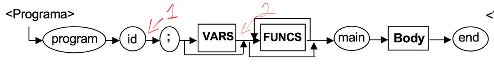

# Compiladores. Little Duck - PHMaci

## Entrega #0

#### Expresiones Regulares

- ID -> ^\\$[a-zA-Z0-9]+
- CTE_STRING -> "[.*]"
- CTE_INT -> [0-9]+
- CTE_FLOAT -> [0-9]+\\.[0-9]+

#### Lista de Tokens

- program, main, void, end, var, int, float, print, do, while, if, else
- ( ) { } [ ] , : ;
- \+ \- \* / = > < !=

## Entrega #1

La investigación de herramientas resultó sencillo gracias a un repositorio que recogía las principales herramientas para el propósito de la entrega:

> https://gist.github.com/dimitrio-m/cf6cde052787ed97164fe6422a5e4cb0

Dado que mi propósito en un principio era hacerlo con PHP, el hecho de que no estuviera en la lista me hizo cambiar de opinión a otro lenguaje que me gusta mucho, el cual es Javascript, y, aunque ANTLR no era la primera como sí lo era Nearley, su documentación me resultó más complicada de entender, encontrando además con la segunda la opción de PHP en su documentación y ejemplos claros de su uso; Por esto último, cuando exploré la documentación del proceso en PHP se me hizo más fácil hacerlo en Javascript por el hecho del package.json y la instalación de dependencias como la evidentemente necesaria ANTLR4, sin dejar de lado la inspiración de PHP al seguir un poco su sintaxis.

En esta entrega cambié el REGEX de ID debido a problemas de ANTLR, ya que, al tratar de omitir las " entre cualquier string ( " '"' " ), no detectaba cuando se procesaba un ejemplo.
El lenguaje con el que basé mi sintaxis fue PHP, viniendo de ahí el nombre; sin embargo, para generar los archivos necesarios para el árbol usé Javascript.

---

La forma de generar los archivos necesarios para poder probar nuestra lógica de código es la siguiente:

> npm run lexparse

_En caso de que no funcione, correr cada uno de estos comandos por separado_

> antlr4 -Dlanguage=JavaScript -o antlr_generated_files LittleDuckLexer.g4
> antlr4 -Dlanguage=JavaScript -o antlr_generated_files LittleDuckParser.g4

_Si tampoco funciona, el problema probablemente será que no tiene instalado antlr4, por lo que lo puede descargar de la siguiente forma:_

> sudo curl -O https://www.antlr.org/download/antlr-4.13.1-complete.jar

_Considera tener la última versión de Java, la cual puede descargar en la siguiente liga:_

> https://www.oracle.com/java/technologies/downloads/

---

Ahora, la forma de correr los tests es con los siguientes pasos:

> npm install

> npm run go

## Entrega #2

En esta etapa, el primer paso fue decidir qué tipo de estructura se usaría para la parte de la semántica del directorio de funciones y sus tablas de variables, yéndonos por el camino más ágil por _llaves_ como lo son los **diccionarios** y seccionadas en clases.
Por otro lado, también se tuvo que crear el cubo semántico (el cual **no** haremos uso de él **todavía**) para tener los tipos que arrojaría cuando se haga uso de un operador. Para estos casos, decidí hacer una tabla, donde **I** es igual a _INTEGER_, mientras que **F** es igual a _FLOAT_, siendo los únicos dos tipos de variable con los que cuenta nuestro programa; pudiendo interacturar con distintos operadores y demostrando una salida para cuando X variable de cierto tipo (I o F) se procesan de acuerdo al operador.
En la siguiente tabla se muestran todas las combinaciones posibles para los operadores con las que cuenta la gramática:

|     | I I | I F | F I | F F |
| --- | --- | --- | --- | --- |
| +   | I   | F   | F   | F   |
| -   | I   | F   | F   | F   |
| \*  | I   | F   | F   | F   |
| /   | I   | F   | F   | F   |
| >   | I   | I   | I   | I   |
| <   | I   | I   | I   | I   |
| !=  | I   | I   | I   | I   |
| =   | I   | I   | F   | F   |

Después, se establecieron los puntos neurálgicos

1. En este punto se crear el directorio de funciones para guardar el nombre del programa, significando que no se puede crear una función después con el mismo nombre.

2. Para este punto, una vez se hayan creado las variables, estas serán globales y se guardarán para la función "programa".

3. Se inicializa la tabla de variables para la función que se esté trabajando en ese momento.

4. Se checa si ya existe dicha variable en ese contexto, en caso de que sí, se arroja una excepción y manda error por variable ya declarada.

5. Se asocia el tipo a toda la lista de variables del contexto que estemos hablando.

6. Se crear la función y se agrega al diccionario de funciones, revisando también si ya existe, en caso de que sí, arrojaría un error de función ya declarada como pasa con la lista de variables.

7. Se crean los argumentos y se va revisando si ya existen, en caso de que sí, arroja un error de argumento ya declarado.

8. Una vez se hayan creado las variables, estas se guardarán también en el listado de variables de la función que estemos hablando.
